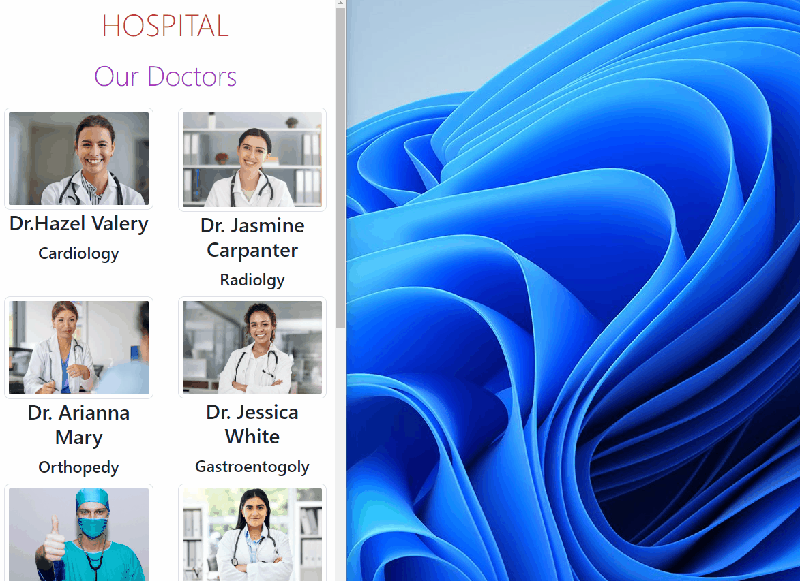

# Hospital
This project is a website created using React and React-Bootstrap.
## Screen recording:
 
  

## Live Link:
** https://doctors-appointment-app1041.netlify.app **

## Tech/framework used
<b>Built with</b>  
 
 

## Description
In the project directory, you can run:
### `yarn start`
Runs the app in the development mode.\
Open [http://localhost:3000](http://localhost:3000) to view it in your browser.
